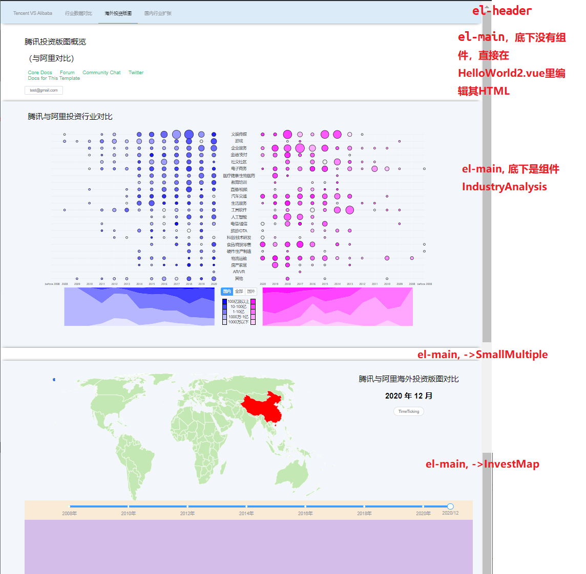

# myproject

> A vue.js project using d3.js to visualize Tencent company.

## Build Setup不用看

``` bash
# install dependencies
npm install

# serve with hot reload at localhost:8080
npm run dev

# build for production with minification
npm run build

# build for production and view the bundle analyzer report
npm run build --report

# run unit tests
npm run unit

# run e2e tests
npm run e2e

# run all tests
npm test
```

For a detailed explanation on how things work, check out the [guide](http://vuejs-templates.github.io/webpack/) and [docs for vue-loader](http://vuejs.github.io/vue-loader).

## 部署本项目

1. 把本项目clone下来
2. 下载安装node.js服务器程序，按[这里](https://www.runoob.com/nodejs/nodejs-install-setup.html)写的配好环境变量
3. 在本文件所在目录打开cmd命令行，输入`npm run dev`回车，服务器开启，打开localhost:8080即可看到本项目。
4. 在服务器开启的情况下，所有的更改都会即时生效刷新。
5. 关闭服务器：在命令行ctrl+c

## 项目架构

采用vue架构，组件化编程，把所有的东西都视为组件，src/components/就是用到的所有组件，一个vue文件是一个组件，包含了这个组件的所有HTML模板、CSS样式以及用到的js函数，这样组织条理比较清晰。

- static/ 静态资源
  - icon/svg svg图标
  - raw/ 原始数据，没有直接在项目中使用
  - 其他文件基本上是项目直接使用的数据文件
- src/ 源代码
  - assets/ 不用管，里面是一个全局css样式表和经过转换的svg的对应js代码
  - router/ store/ 不用管
  - main.js 不用管
  - App.vue 项目入口，不用管
  - components/
    - HelloWorld.vue IndustryAnalysis1.vue 备份文件，不用管
    - scatterplot.vue 没用，不用管
    - HelloWorld2.vue 主页大框架组件
    - IndustryAnalysis.vue 第一个图
    - InvestMap.vue 第二个图
    - SmallMultiple.vue 还没实现的图

- build/ config/ 相关配置，不用管
- node_modules/ 所用js库，不用管
- test/ 以及其他的，不用管


组件树示意：
```
- App
  - HelloWorld2
    - el-header
    - el-main 
    - el-main -> IndustryAnalysis
    - el-main -> SmallMultiple
    - el-main -> InvestMap
```



## 各自任务部位

先介绍vue组件的框架：
```html
<template>
  组件的HTML模板
</template>
<script>
export default {
  data() {
    return {
      // 这个部件用到的数据
    }
  },
  methods: {
    // 定义的js函数
  },
  created() {
    // 组件的DOM加载出来后要执行的js语句，主要就是加载数据、调用methods里的画图函数
  }
}
</script>
<style>
  组件的CSS样式
</style>
```

- 顾相：HelloWorld2.vue的第一个`<el-main>`里的部分，把`<el-header>`里那个第一个按钮的样式也改改，用上/static/icon/里的公司logo
- 陈浩然：负责做smallMultiple的单个图就行，建议不要在这个vue项目里实现，因为结构你可能弄不清楚，建议单独实现一个小项目来做这个图，你要的数据应当在/static/raw/data_merge0114.xlsx里，导出相应数据到csv之后记得转utf-8编码。实现可以参考作业2的样例和我的IndustryAnalysis.vue里的drawScatter, drawPoints.
- 刘彦韬：做第一个图的排序数据，然后其实不需要这个数据只需要顺序了，在IndustryAnalysis.vue的59-63行改成按对应顺序排好的顺序就行了，注意这儿的行业是从0开始，0-21对应之前的1-22.所以这部分的主要任务变成了行业顺序（纵坐标轴）变化之后，两边数据点的重新绘制。数据点的绘制在148行drawPoints()函数里，182-190行的cx和cy就是数据点circle的横纵坐标，只需要改纵坐标，你类比原本的算法计算重排纵坐标之后应该在哪一行，然后更改这部分就可以。
